# helpFly 助手

一款基于 **Wails3 + Vue3 + ArcoDesign + GoFrame** 的桌面端应用脚手架。

项目仓库：[gzdzh-cn/helpFly-tool](https://github.com/gzdzh-cn/helpFly-tool)

它不只是一个 Demo，而是一套**开箱即用的桌面程序骨架**：内置多个常见业务页面的范例（表单、图标、图表、组件），并附带一个**真正对接数据库、可增删改查的账单模块**。你只需在它的基础上修改，就能快速拥有自己的桌面应用。

---

# 快速开始

## 1. 环境准备
- 安装 [Go](https://go.dev/)（建议较新版本）
- 安装 [Node.js](https://nodejs.org/)（含 npm / npx）
- 安装 Wails3 命令行工具（`npm` 或 `go install` 方式均可，本项目使用 Wails3）

## 2. 常用命令

```bash
wails3 dev      # 启动开发模式：前端热更新 + 后端自动重编译，改完立即生效
wails3 build    # 打包为可分发的桌面程序
cd frontend && npx vite build   # 仅构建/校验前端
```

应用窗口默认大小为 `1280 × 800`，可在 `main.go` 的窗口配置中调整。

## 3. 打包与分发

`wails3 package` 在各平台都会产出可直接运行的程序包（macOS 为 `.app`，Windows 为 `.exe` 或安装包，Linux 为可执行文件或 `.deb`/`.AppImage`）。

### 3.1 各平台打包命令

Wails3 的打包任务是平台相关的，**在哪个平台上运行，就打出哪个平台的包**。Go 也支持交叉编译，但打包成桌面安装包（`.app` / `.msi` / `.dmg`）通常必须在目标系统上执行，因为它们依赖各自平台的签名、图标与安装器工具链。

| 目标平台 | 执行环境 | 一键打包命令 | 产出 |
| --- | --- | --- | --- |
| macOS | 在 macOS 上 | `wails3 package` | `bin/helpFly.app` |
| macOS（带可拖拽安装窗口的 DMG） | 在 macOS 上 | `wails3 task darwin:package:macdmg` | `bin/helpFly.dmg`（含 Applications 链接） |
| macOS 通用二进制（Intel + Apple 芯片） | 在 macOS 上 | `wails3 task darwin:package:universal` | 通用 `bin/helpFly.app` |
| Windows | 在 Windows 上 | `wails3 task windows:package:installer` | `bin/helpFly-installer.exe`（NSIS 安装包，含 WebView2 引导器） |
| Linux | 在 Linux 上 | `wails3 package` | 可执行文件 / `.deb` / `.AppImage` 等 |

> 注意：跨平台只能做到「交叉编译出二进制」，完整安装包（含图标、签名、注册表/桌面集成）必须在目标系统上执行对应命令。CI 中可用 GitHub Actions 矩阵分别在各平台 runner 上执行对应命令。
> Windows 的 NSIS 安装包依赖 `makensis` 与 WebView2 bootstrapper，**只能在 Windows 上打包**；macOS 的 DMG 同理只能在 macOS 上打包。

### 3.2 打包 macOS DMG（带「拖入应用程序」安装窗口）

`hails3 package` 只产出 `.app`，不会生成 DMG。要想挂载后出现「把 app 拖到 Applications 文件夹」的安装窗口，需要在镜像里放入一个指向 `/Applications` 的**符号链接**，再封成 DMG。

#### 推荐：一条命令搞定（零依赖）

本项目已在 `build/darwin/Taskfile.yml` 中封装好 `package:macdmg` 任务，它会依次完成「编译 → 打包 `.app` → 加 Applications 符号链接 → 生成 DMG」，全程仅用 macOS 自带的 `hdiutil`，无需安装任何第三方工具：

```bash
# 在 macOS 上执行，一步产出 bin/helpFly.dmg（带可拖拽安装窗口）
wails3 task darwin:package:macdmg
```

完成后 `bin/helpFly.dmg` 即为可分发的安装镜像：双击挂载后，窗口里同时显示 `helpFly.app` 和 `Applications` 文件夹图标，**把 app 拖到 Applications 即可完成安装**。

#### 手动分步（等价于上面的命令，便于理解或非 Task 环境使用）

```bash
# 1) 生成 .app 包（已包含前端构建与后端编译）
wails3 package

# 2) 准备 DMG 暂存目录：放入 app + 一个名为 Applications 的符号链接
DMG_STAGING=/tmp/helpFly-dmg
rm -rf "$DMG_STAGING"
mkdir -p "$DMG_STAGING"
cp -R bin/helpFly.app "$DMG_STAGING/"
# 关键：创建指向系统「应用程序」文件夹的符号链接，拖拽时即安装到 /Applications
ln -s /Applications "$DMG_STAGING/Applications"

# 3) 生成可拖拽安装的 DMG（无需额外依赖，使用 macOS 自带 hdiutil）
hdiutil create -volname "helpFly" \
  -srcfolder "$DMG_STAGING" \
  -ov -format UDZO \
  bin/helpFly.dmg

# 4) 清理暂存目录
rm -rf "$DMG_STAGING"
```

#### 可选：美化安装窗口（背景图、图标排列）

上面的方案已满足「可拖拽安装」的核心需求。若想进一步定制窗口背景、图标位置与大小（让 app 与 Applications 并排、居中对齐），可改用第三方 `create-dmg` 工具：

```bash
npm i -g create-dmg
create-dmg bin/helpFly.dmg bin/helpFly.app --volname "helpFly" --overwrite
```

> 提示：`wails3 task darwin:package:macdmg`（基于 `hdiutil`）零依赖、最稳妥；`create-dmg` 更美观但依赖第三方包，可按需选择。

## 4. 数据存储位置

应用使用 SQLite 本地数据库，文件位置随「开发 / 生产」环境自动切换：

| | 开发模式 | 生产模式 |
| --- | --- | --- |
| 数据库位置 | 项目目录下的 `resource/app.db` | 系统用户配置目录中的 `helpfly/app.db` |
| Windows | 项目 `resource/` | `%AppData%/helpfly/app.db` |
| macOS | 项目 `resource/` | `~/Library/Application Support/helpfly/app.db` |
| Linux | 项目 `resource/` | `~/.config/helpfly/app.db` |
| 调试日志 | 开启（可见 SQL） | 关闭（更干净，启用 WAL） |

> 首次启动会自动创建目录与数据表，无需手动初始化。
> 如需自定义路径，可设置环境变量 `GOFLY_DB_PATH` 指定，优先级最高。

## 4. 启动后建议体验
1. 左侧主菜单进入「首页」，查看演示卡片。
2. 进入「数据」→ **账单列表**，体验真实数据库的增删改查、导出与高级搜索。
3. 点击顶栏「设置」，尝试主题切换与各类窗口调试能力。

---

# 功能模块一览

## 1. 整体架构

```
   前端页面（Vue3）
        │  调用
        ▼
   自动生成的接口绑定（bindings）
        │
        ▼
   Go 后端服务（Service 层）
        │
        ▼
   GoFrame ──→ SQLite 数据库
```

- 桌面界面由系统 WebView 渲染，业务逻辑用 Go 编写。
- 前端通过 Wails 生成的绑定直接调用 Go 方法，Go 处理后再把数据返回前端展示。

## 2. 技术栈

| 层 | 技术 | 作用 |
| --- | --- | --- |
| 桌面外壳 | Wails3 | 用系统浏览器内核承载界面，Go 提供后端能力 |
| 前端 | Vue3 + TypeScript + Vite | 页面与交互逻辑 |
| UI 组件 | ArcoDesign | 按钮、表格、表单等现成组件 |
| 图表 | ECharts | 柱状、折线、饼图等多种可视化 |
| 状态管理 | Pinia | 全局共享状态（如主题） |
| 后端 | GoFrame (gf) | 数据库与业务逻辑框架 |
| 数据库 | SQLite | 轻量本地文件数据库 |

## 3. 目录结构

```
项目根目录/
├── main.go              # 程序入口：创建窗口、注册服务、监听事件
├── wails.json           # 打包配置
├── frontend/            # 前端工程
│   └── src/
│       ├── main.ts      # 前端入口
│       ├── App.vue      # 根组件（顶栏：主题 / 窗口控制）
│       ├── router/
│       │   └── routerMap.ts   # ★ 所有栏目的定义，新增页面先改这里
│       ├── layouts/
│       │   ├── AppSider.vue   # 一级布局（首页 / 数据 / 设置）
│       │   └── Menu.vue       # 二级布局（"数据"下的子菜单）
│       ├── store/       # 全局状态（主题等）
│       ├── components/
│       │   ├── chart/        # ★ 图表封装
│       │   └── icons/        # 图标（在线 + 本地）
│       ├── views/
│       │   ├── home/              # 首页（演示卡片）
│       │   ├── setting/           # 设置（调试能力）
│       │   └── submenu/           # "数据"下的子页面
│       │       ├── consumption-list/  # ★ 唯一对接数据库的表格
│       │       ├── form-demo/         # 表单演示
│       │       ├── icon-gallery/       # 图标专栏
│       │       ├── chart-demo/         # 图表演示
│       │       └── component-demo/     # 通用组件演示
│       └── bindings/   # 由 Wails 自动生成的接口绑定
└── internal/            # Go 后端
    ├── dao/  model/     # 数据访问与模型（自动生成）
    └── service/         # 后端服务（DbService 等）
        └── db/          # SQLite 读写实现
```

## 4. 页面模块

菜单由路由表 `routerMap.ts` 自动生成——**新增页面只需先在 `routerMap.ts` 登记，菜单便会自动出现**。

- **首页**：以卡片形式展示统计与图表类演示。
- **数据**（二级菜单）：
  - **账单列表** ★：唯一真正对接数据库的模块，支持新增、编辑、删除、导出、高级搜索；可在「后端 / Mock」之间切换（后端不可用时自动降级为本地内存数据，演示不中断）。
  - **表单演示**：新增 / 编辑 / 详情三种模式，覆盖常用输入控件与表单校验。
  - **图标专栏**：在线 iconfont 与本地 SVG 图标库，支持分类切换、搜索、分页。
  - **图表分析**：柱状、折线、饼、环、散点、雷达、仪表盘等图表范例（前端示例数据）。
  - **通用组件**：Tabs / Steps / Timeline / Tag / Progress / Tree / Modal 等组件集合。
  - **参数设置**：系统名称、主题、语言、同步、通知、安全等配置表单；主题模式可真实切换全局外观。
- **设置**（顶栏进入）：大量桌面调试能力。

### 界面预览（亮色主题）

> 以下截图按页面顺序展示：首页 → 账单列表 → 表单演示 → 图标专栏 → 图表分析 → 通用组件 → 参数设置 → 设置页。

| 首页 | 账单列表 | 表单演示 | 图标专栏 |
| --- | --- | --- | --- |
| <a href="docs/images/亮色-1.jpg" target="_blank">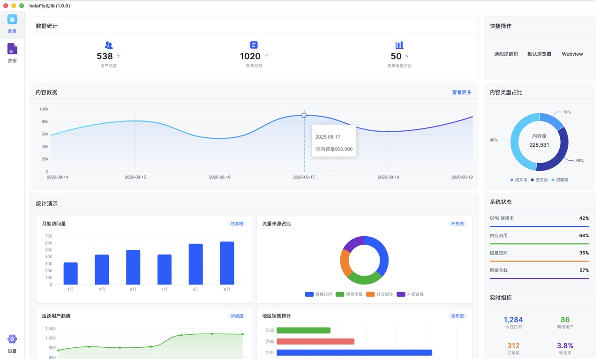</a> | <a href="docs/images/亮色-2.jpg" target="_blank">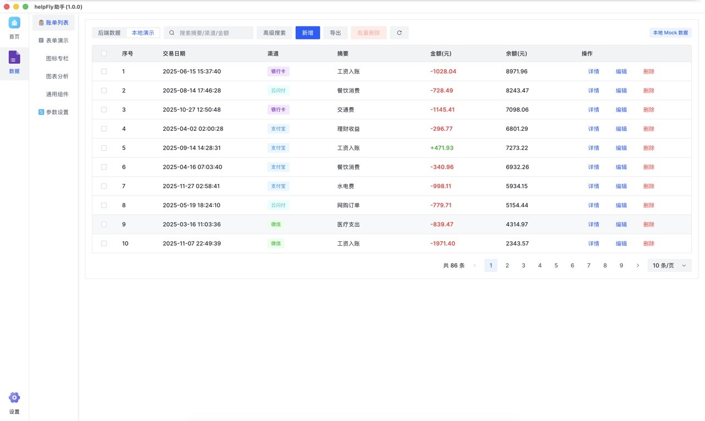</a> | <a href="docs/images/亮色-3.jpg" target="_blank">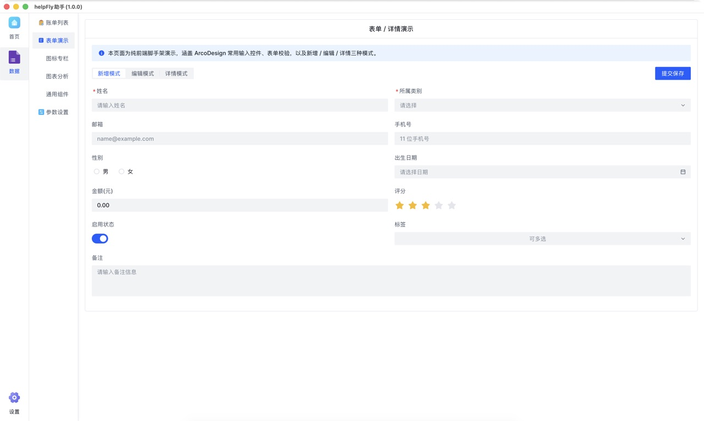</a> | <a href="docs/images/亮色-4.jpg" target="_blank">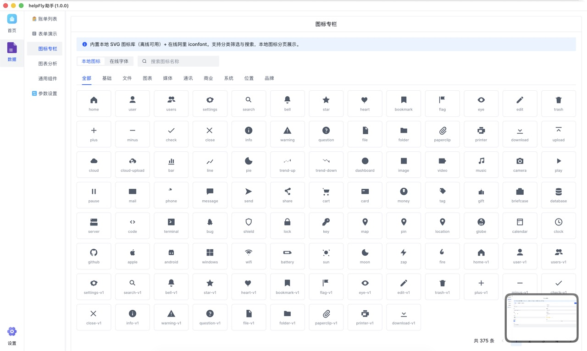</a> |

| 图表分析 | 通用组件 | 参数设置 | 设置页 |
| --- | --- | --- | --- |
| <a href="docs/images/亮色-5.jpg" target="_blank">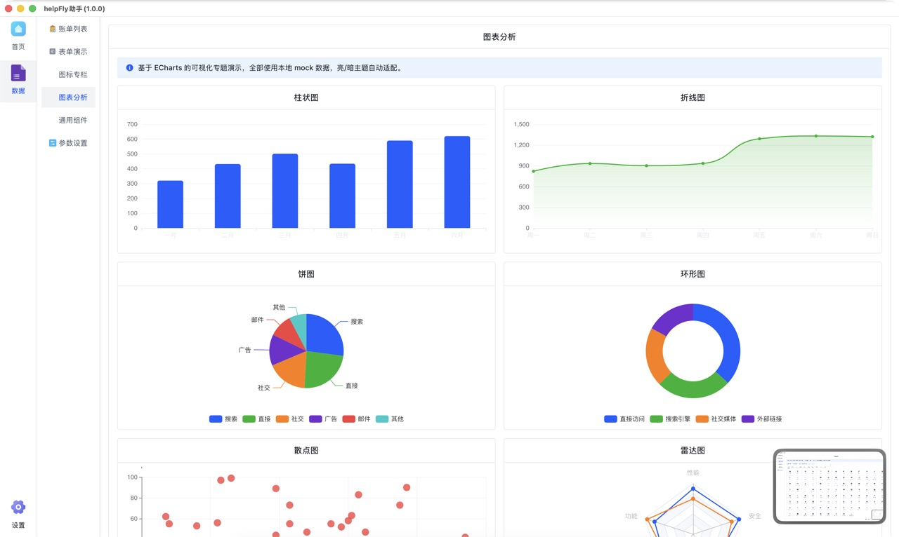</a> | <a href="docs/images/亮色-6.jpg" target="_blank">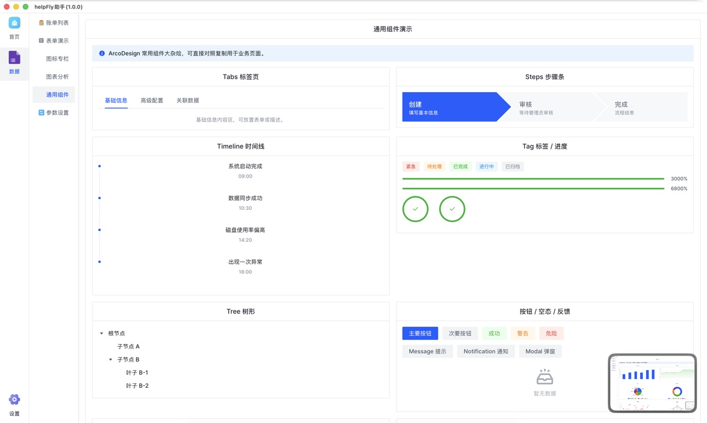</a> | <a href="docs/images/亮色-7.jpg" target="_blank">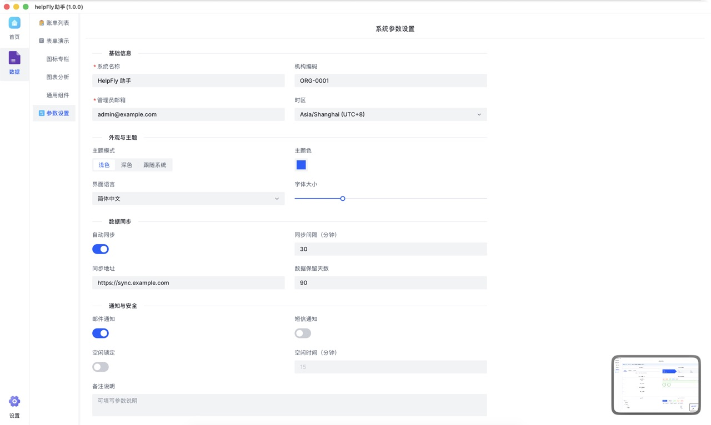</a> | <a href="docs/images/亮色-8.jpg" target="_blank">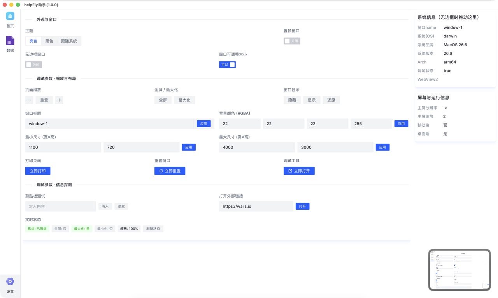</a> |

### 界面预览（暗色主题）

| 首页 | 账单列表 | 表单演示 | 图标专栏 |
| --- | --- | --- | --- |
| <a href="docs/images/暗色-1.jpg" target="_blank">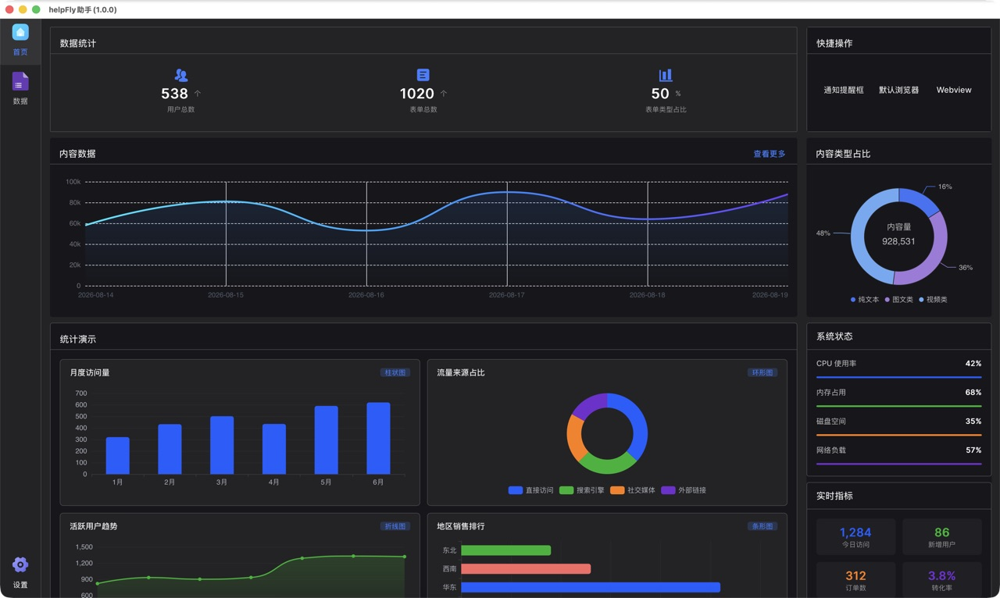</a> | <a href="docs/images/暗色-2.jpg" target="_blank">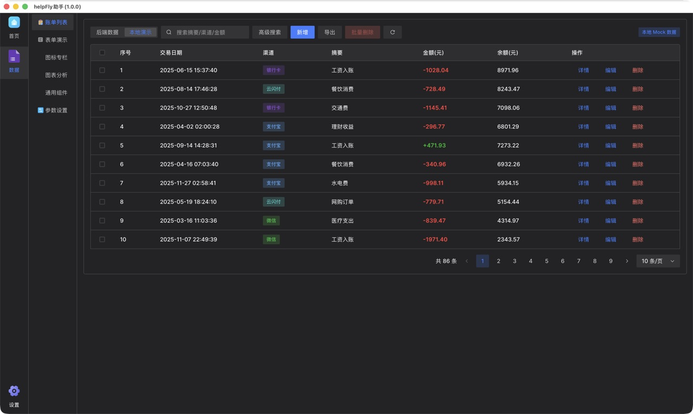</a> | <a href="docs/images/暗色-3.jpg" target="_blank">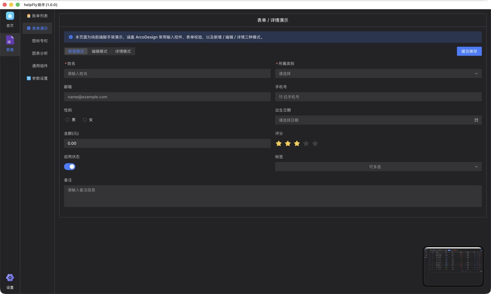</a> | <a href="docs/images/暗色-4.jpg" target="_blank">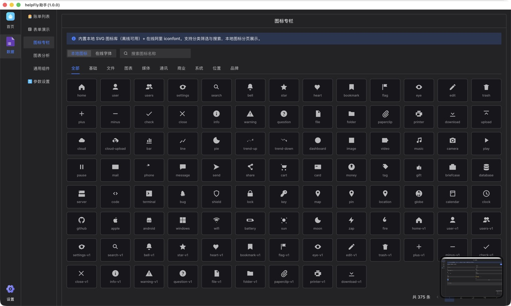</a> |

| 图表分析 | 通用组件 | 参数设置 | 设置页 |
| --- | --- | --- | --- |
| <a href="docs/images/暗色-5.jpg" target="_blank">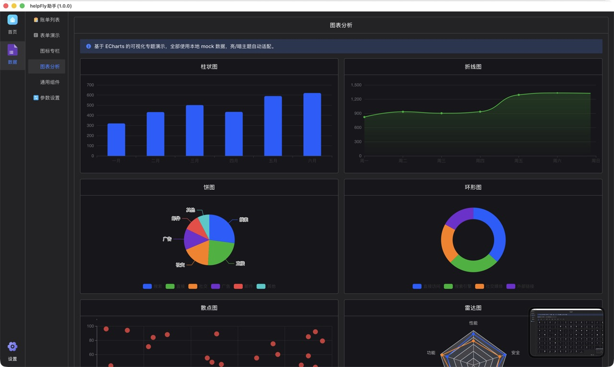</a> | <a href="docs/images/暗色-6.jpg" target="_blank">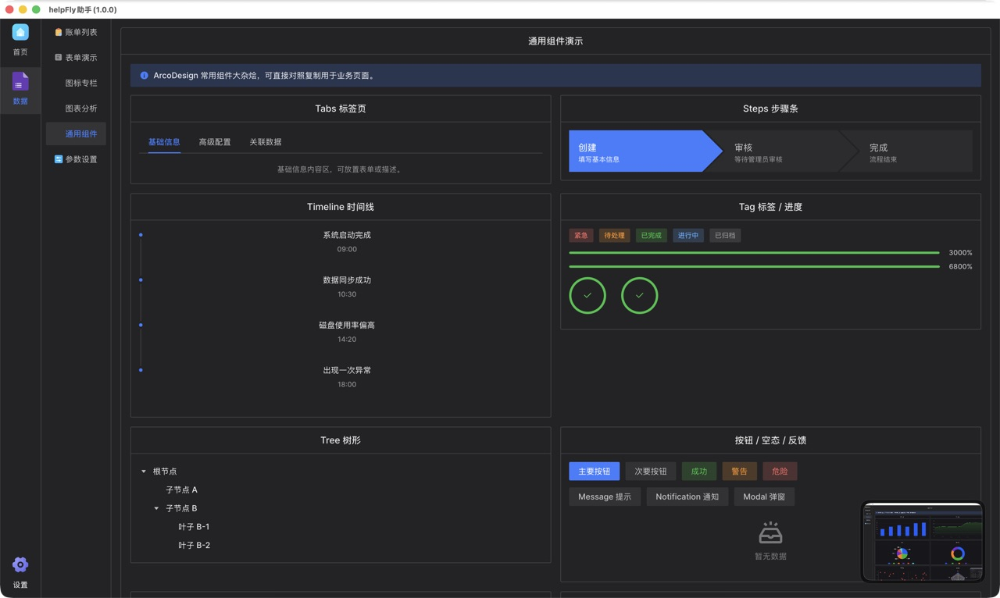</a> | <a href="docs/images/暗色-7.jpg" target="_blank">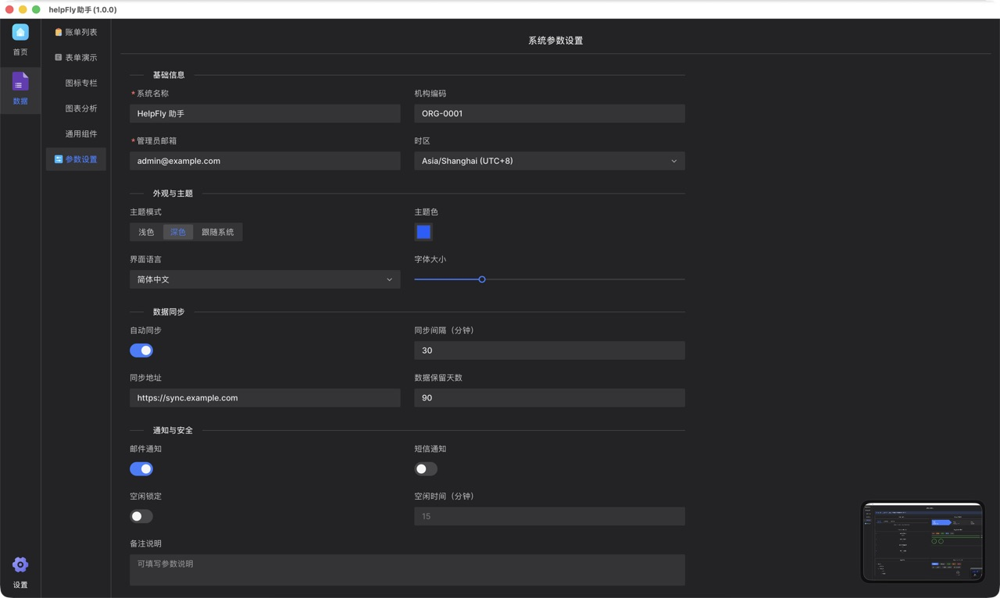</a> | <a href="docs/images/暗色-8.jpg" target="_blank">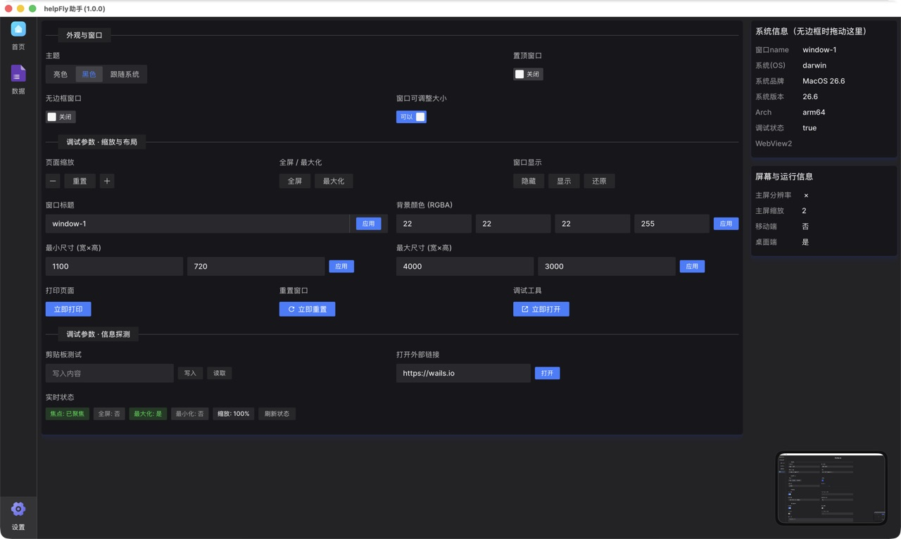</a> |

> 提示：截图均以 `<a>` 包裹 `` 实现点击放大——点击任意图片会在新标签页打开高清原图（`.jpg`）。若站点支持灯箱（如 VitePress），点击即可在原页内放大。

## 5. 后端服务

程序启动时，以下 Go 服务被暴露给前端调用：

| 服务 | 用途 |
| --- | --- |
| `GreetService` | 主题交互等示例 |
| `MessageService` | 消息与事件示例 |
| `OpenWindow` | 窗口控制 |
| `HttpService` | 网络请求示例 |
| `DbService` | 数据库读写（账单增删改查） |

`DbService` 的关键能力：
- `AddConsumption` / `UpdateConsumption`：新增 / 修改账单记录，真实落库。
- 账单原始字段较丰富，前端表格精简展示 5 项：**交易日期、渠道、摘要、金额、余额**。

> 接口绑定由 `wails3 generate bindings` 自动生成，若后端方法有变动，重新执行该命令即可，无需手动维护。

## 6. 公共能力

- **图表**：`components/chart` 是对 ECharts 的统一封装，按需注册图表类型；页面通过 `useChartOption` 生成配置后传给 `<Chart>` 组件即可使用。
- **图标**：
  - 在线：阿里 iconfont，使用 `<icon-font :type="...">`。
  - 本地：内置一批 SVG 图标，不依赖网络。
- **主题**：`store/modules/app` 保存主题状态，顶栏、设置页、参数设置页均通过同一套逻辑真实切换亮 / 暗外观。

## 7. 设置页调试能力

设置页直接调用桌面运行时，便于开发调试：
- **外观**：亮 / 暗 / 跟随系统主题、窗口置顶、无边框、是否可调整大小。
- **窗口**：缩放、全屏 / 最大化、隐藏 / 显示 / 还原、修改标题、修改背景色、限制最小 / 最大尺寸、打印、重置、打开调试工具。
- **探测**：剪贴板读写、打开外部网页、实时窗口状态、屏幕分辨率、系统信息（操作系统 / 版本 / WebView2 等）。

## 8. 使用要点

1. **新增页面**：在 `routerMap.ts` 登记路由后，菜单自动出现。
2. **双层菜单**：一级用 `AppSider`，"数据"下的子页用 `Menu`；内容过长时区域自动出现滚动条。
3. **主题切换**：顶栏、设置页、参数设置页效果一致，均走同一套主题逻辑。
4. **数据真假**：仅账单列表对接真实数据库，其余演示页面均为前端示例数据。
